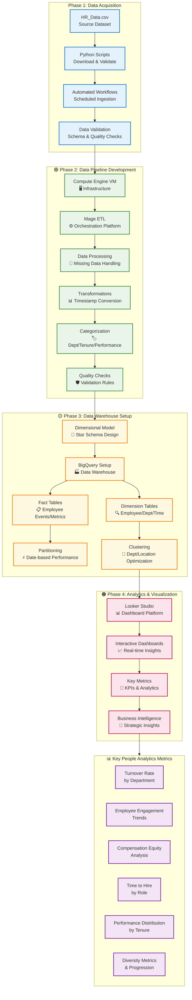

```mermaid
graph TB
    %% Phase 1: Data Acquisition
    subgraph P1 ["Phase 1: Data Acquisition"]
        A[HR_Data.csv<br/> Source Dataset] --> B[Python Scripts<br/> Download & Validate]
        B --> C[Automated Workflows<br/> Scheduled Ingestion]
        C --> D[Data Validation<br/> Schema & Quality Checks]
    end
    
    %% Phase 2: Data Pipeline Development  
    subgraph P2 ["🟢 Phase 2: Data Pipeline Development"]
        E[Compute Engine VM<br/>🖥️ Infrastructure] --> F[Mage ETL<br/>⚙️ Orchestration Platform]
        F --> G[Data Processing<br/>🔄 Missing Data Handling]
        G --> H[Transformations<br/>📊 Timestamp Conversion]
        H --> I[Categorization<br/>🏷️ Dept/Tenure/Performance]
        I --> J[Quality Checks<br/>🛡️ Validation Rules]
    end
    
    %% Phase 3: Data Warehouse Setup
    subgraph P3 ["🟡 Phase 3: Data Warehouse Setup"]
        K[Dimensional Model<br/>📐 Star Schema Design] --> L[BigQuery Setup<br/>🏭 Data Warehouse]
        L --> M[Fact Tables<br/>📋 Employee Events/Metrics]
        L --> N[Dimension Tables<br/>🔍 Employee/Dept/Time]
        M --> O[Partitioning<br/>⚡ Date-based Performance]
        N --> P[Clustering<br/>🎯 Dept/Location Optimization]
    end
    
    %% Phase 4: Analytics & Visualization
    subgraph P4 ["🟠 Phase 4: Analytics & Visualization"]
        Q[Looker Studio<br/>📊 Dashboard Platform] --> R[Interactive Dashboards<br/>📈 Real-time Insights]
        R --> S[Key Metrics<br/>📏 KPIs & Analytics]
        S --> T[Business Intelligence<br/>🎯 Strategic Insights]
    end
    
    %% Data Flow Connections
    D --> E
    J --> K
    P --> Q
    
    %% Detailed Metric Examples
    subgraph METRICS ["📊 Key People Analytics Metrics"]
        M1[Turnover Rate<br/>by Department]
        M2[Employee Engagement<br/>Trends]
        M3[Compensation Equity<br/>Analysis]
        M4[Time to Hire<br/>by Role]
        M5[Performance Distribution<br/>by Tenure]
        M6[Diversity Metrics<br/>& Progression]
    end
    
    T --> METRICS
    
    %% Styling
    classDef phase1 fill:#e3f2fd,stroke:#1976d2,stroke-width:2px
    classDef phase2 fill:#e8f5e8,stroke:#388e3c,stroke-width:2px  
    classDef phase3 fill:#fff8e1,stroke:#f57c00,stroke-width:2px
    classDef phase4 fill:#fce4ec,stroke:#c2185b,stroke-width:2px
    classDef metrics fill:#f3e5f5,stroke:#7b1fa2,stroke-width:2px
    
    class A,B,C,D phase1
    class E,F,G,H,I,J phase2
    class K,L,M,N,O,P phase3
    class Q,R,S,T phase4
    class M1,M2,M3,M4,M5,M6 metrics
```
